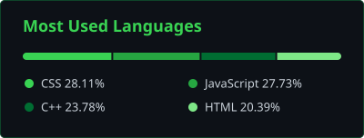

<!-- Header -->

  Information Technology student building IoT, embedded systems and web apps.

  
  
  

---

### Stack

---

### Projects

| Project | Description | Tech | Link |
|---|---|---|---|
| **Study Tracker** | Full-stack study tracking app with accounts and progress dashboard | Node.js, Express |  |
| **Smart Industrial Hazard Monitoring** | ESP32 safety monitor with sensors, web dashboard and hazard alerts | ESP32, HTML, JS |  |
| **ESP32 Temp & Humidity Monitor** | Real-time DHT11 readings on a web page | ESP32, C++ |  |
| **Mini Games** | Pixel-style browser games hub | HTML, CSS, JS |  |

---

### Stats

  
  

